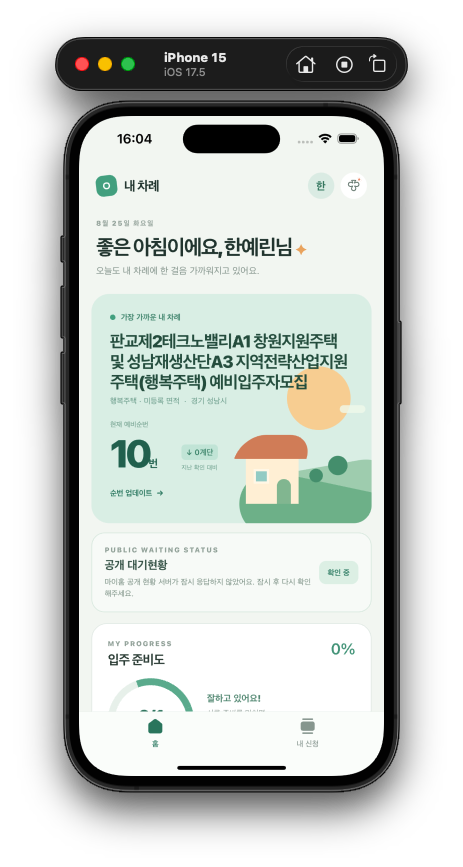
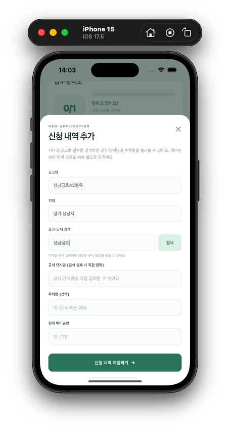
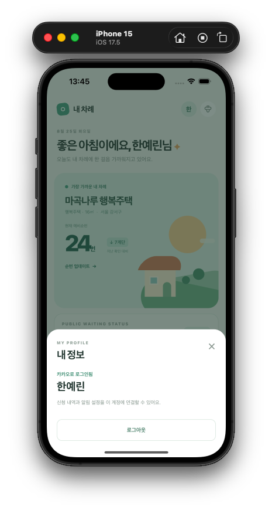

# 내 차례

> 임대주택 예비입주자의 신청 내역과 순번을 관리하고, 공개 대기현황 변동을 알려주는 모바일 앱

<p>
  
  
  
  
</p>

`내 차례`는 임대주택 예비입주자가 신청 정보를 한 곳에 모아두고, 순번 변화와 입주 준비 과정을 놓치지 않도록 돕는 iOS·Android 앱입니다.

## ✨ 주요 기능

| 기능 | 설명 |
| --- | --- |
| 카카오 로그인 | 사용자 프로필을 연결하고 개인 신청 정보를 보호합니다. |
| 신청 내역 관리 | 공고명, 공식 단지명, 지역, 예비순번을 등록합니다. |
| 순번 이력 | 순번을 기록할 때마다 변화 내역을 남깁니다. |
| 공개 대기현황 | 마이홈 공공 API에서 단지별 공개 대기인원을 조회합니다. |
| 변동 알림 | 공개 대기인원이 변경되면 앱 알림과 푸시 알림을 보냅니다. |
| 입주 준비 체크리스트 | 신청별로 준비할 일을 추가하고 진행률을 확인합니다. |

## 📱 화면 미리보기

<p align="center">
  
  
  
</p>

<p align="center">
  <sub>홈 대시보드 · 공식 공고·단지 검색 · 카카오 로그인</sub>
</p>

## 🔄 동작 흐름

```text
카카오 로그인
      ↓
신청 내역 등록
      ↓
동기화 서버가 마이홈 공공 API 주기 조회
      ↓
이전 공개 대기인원과 비교
      ↓
변동 발생 시 앱 · 푸시 알림
```

## ⚠️ 현재 API의 범위

마이홈 공공 API가 제공하는 값은 **개인별 예비순번이 아닌 단지별 공개 대기인원**입니다.

따라서 이 앱은 다음 두 정보를 구분해 관리합니다.

- 사용자가 직접 등록하는 개인 예비순번
- 공식 API로 자동 조회하는 단지별 공개 대기인원

개인 순번을 자동으로 가져오려면 LH·마이홈의 별도 공식 연동 승인이 필요합니다. 비밀번호, 주민등록번호, 공동인증서, 마이홈 개인 세션을 수집하거나 자동화하지 않습니다.

## 🧱 기술 스택

- Expo 57 / React Native 0.86
- TypeScript / Expo Router
- Native Kakao Login SDK
- AsyncStorage 기반 로컬 데이터 저장
- Node.js 동기화 서버
- MyHome 공공데이터 API
- Expo Notifications / Expo Push Notification

## 📁 프로젝트 구조

```text
housing-tracker-mobile/
├── src/
│   ├── app/                 # 홈 · 내 신청 화면
│   ├── components/          # 탭바와 공통 UI
│   ├── data/                # 로컬 저장 모델과 마이그레이션
│   └── services/            # 카카오 로그인 · 알림 · 공개현황 동기화
├── server/
│   ├── index.mjs            # 동기화 API와 주기 실행 서버
│   └── myhome-api.mjs       # 마이홈 공공 API 클라이언트
├── app.config.js            # 네이티브 카카오 SDK 설정
├── app.json                 # Expo 앱 설정
└── .env.example             # 환경변수 예시
```

## 🚀 시작하기

### 1. 의존성 설치

Node.js LTS 환경에서 실행합니다.

```bash
npm install
```

### 2. 환경변수 설정

```bash
cp .env.example .env
```

`.env`에 필요한 값을 입력합니다.

```env
# 서버에서만 읽는 마이홈 공공데이터 인증키
MYHOME_API_KEY=

# 모바일 앱이 접근할 동기화 서버 주소
EXPO_PUBLIC_SYNC_SERVER_URL=http://127.0.0.1:8787

# 실기기 푸시에 필요한 EAS 프로젝트 ID
EXPO_PUBLIC_EAS_PROJECT_ID=

# 카카오 디벨로퍼스의 네이티브 앱 키
EXPO_PUBLIC_KAKAO_NATIVE_APP_KEY=
```

`.env`는 저장소에 커밋하지 않습니다.

### 3. 카카오 네이티브 앱 설정

카카오 디벨로퍼스의 `플랫폼 키 → 네이티브 앱 키`에서 다음 정보를 등록합니다.

| 플랫폼 | 값 |
| --- | --- |
| iOS 번들 ID | `com.anonymous.housing-tracker` |
| Android 패키지명 | `com.anonymous.housingtracker` |

카카오 로그인을 활성화하고 `profile_nickname` 동의항목을 설정한 뒤 네이티브 앱 키를 `.env`에 입력합니다.

### 4. 동기화 서버 실행

별도 터미널에서 실행합니다.

```bash
npm run server
```

서버 기본 주소는 `http://localhost:8787`입니다.

```bash
# 서버 상태 확인
curl http://localhost:8787/health

# 1회 동기화 실행
npm run server:sync
```

기본 조회 주기는 1시간이며, 필요하면 환경변수로 변경할 수 있습니다.

```bash
SYNC_INTERVAL_MINUTES=60 npm run server
```

### 5. 개발 앱 실행

카카오 네이티브 SDK를 사용하므로 Expo Go가 아닌 개발 빌드를 사용합니다.

```bash
# Metro 실행
npx expo start --dev-client

# iOS 개발 빌드
npx expo run:ios --no-bundler

# Android 개발 빌드
npx expo run:android
```

캐시 문제로 이전 화면이 보이면 다음처럼 다시 시작합니다.

```bash
npx expo start --dev-client --clear
```

## 🔔 알림 동작

- iOS 시뮬레이터에서는 앱 내 알림과 로컬 알림으로 동작을 확인합니다.
- 실기기에서는 Expo 푸시 토큰을 서버에 등록합니다.
- 앱이 종료된 상태에서도 변동 알림을 받으려면 동기화 서버가 계속 실행 중이어야 합니다.
- 실제 서비스 배포 시 `server/`를 항상 실행되는 서버 환경에 배포해야 합니다.

## 🔐 개인정보 및 보안

- 공공데이터 인증키는 서버 환경변수에서만 사용합니다.
- 카카오 네이티브 앱 키는 앱 연동용이며, 어드민 키는 사용하지 않습니다.
- 마이홈 로그인 비밀번호나 주민등록번호를 저장하지 않습니다.
- 개인 신청 정보는 현재 기기의 로컬 저장소에 보관됩니다.

## 🧪 확인 명령

```bash
# 타입 검사
npx tsc --noEmit

# 린트
npm run lint
```

## 📄 라이선스

MIT License
